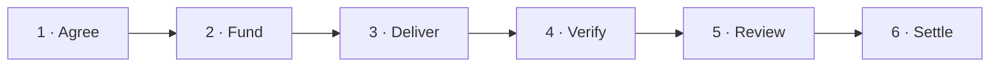

# Protocol lifecycle

Sinetti holds a buyer's payment while a seller delivers against signed terms.
The assigned verifier records a verdict on-chain. The party disadvantaged by
that verdict may challenge it, in which case the assigned arbitrator can submit
the final outcome. Settlement creates withdrawable credits; recipients withdraw
those credits in a separate transaction.

This page describes `SinettiEscrowV04`. It is a protocol view, not an operator
deployment guide. Function and state names below link to the implementation;
the tests remain the executable evidence for the behavior.

## Lifecycle

During review, the party disadvantaged by the verifier's result may challenge
it. A challenge pauses settlement while the selected arbitrator decides whether
to release or refund. If the arbitrator does not answer by its deadline, the
verifier's standing result executes.

Three side paths keep funds from becoming stuck:

| Situation | Result |
|---|---|
| No delivery by the signed deal deadline | `Refunded` |
| Delivery submitted but no verdict by that deadline | `Refunded` |
| Both parties sign a cancellation in any active state | `Cancelled` |

The terminal labels describe the deal state, not an immediate token transfer.
`Released`, `Refunded`, and `Cancelled` allocate pull-payment credits. A credited
party then calls `withdraw` for all or part of its balance; withdrawals may be
partial or repeated and do not change the terminal deal state.

## What is signed and committed

The seller signs an EIP-712 `SellerAcceptance` covering the buyer, seller,
verifier, arbitrator, token, principal, seller bond, challenger bond, acceptance
criteria hash, four opaque identity references, delivery duration, challenge and
ruling windows, opening deadline, salt, and optional meta-evidence URI. The buyer
opens and funds the deal using that exact acceptance. Each acceptance digest can
be consumed only once and can be revoked by the seller before use.

The terms commit to acceptance criteria through `termsHash`; the chain does not
store the criteria document. Delivery similarly commits `evidenceHash`, while
dispute evidence is emitted as an ERC-1497-shaped `Evidence` event rather than
stored in contract state. Documents referenced by a URI or hash may be public,
encrypted, access-controlled, or unavailable; a commitment proves neither
availability nor truth.

## Verification and challenge

Only the verifier selected in the signed deal can call `recordVerification`.
The contract stores `Pass`, `Fail`, or `Inconclusive` and starts the full
challenge window when the verdict is recorded. It does not convert verifier
silence into seller failure: if the signed deal deadline passes without a verdict,
`claimTimeout` refunds the principal and returns any posted seller bond.

Only the party disadvantaged by the standing verdict may challenge it:

| Standing verdict | Eligible challenger | Unchallenged settlement |
|---|---|---|
| `Pass` | Buyer | Release principal and posted seller bond to seller |
| `Fail` | Seller | Refund principal to buyer; return posted seller bond |
| `Inconclusive` | Seller | Refund principal to buyer; return posted seller bond |

A challenge deposits the signed challenger bond and moves the deal to
`Disputed`. The escrow emits `Challenged`; it does not call the arbitrator. The
assigned arbitrator must independently observe the event and answer through
`submitRuling` before the ruling deadline.

## Arbitration, timeouts, and settlement

An explicit `Release` ruling credits the principal, posted seller bond, and
challenger bond to the seller. An explicit `Refund` ruling credits the principal,
posted seller bond, and challenger bond to the buyer; this is the only path that
slashes the seller bond.

If the arbitrator does not rule before its deadline, anyone may call `finalize`.
The standing verifier verdict then executes and the challenger bond returns to
the challenger. Arbitrator silence therefore cannot strand funds or create a new
outcome.

At any active stage, the parties can execute a mutually signed cancellation
bound to the deal's exact revision. It refunds principal to the buyer, returns a
posted seller bond to the seller, and, if already disputed, returns the challenger
bond to the party that posted it.

Every settlement path emits one `Settled` event with buyer and seller credit
amounts and a machine-filterable reason. `RulingSubmitted`, `BondSlashed`, and
`Withdrawn` provide additional evidence where applicable.

## On-chain record and reputation

The escrow stores deal state, the evidence commitment, the verifier verdict,
timestamps, selected roles, opaque identity references, and accounting needed to
settle funds. It also emits the lifecycle, ruling, and settlement events needed
to reconstruct outcomes.

It does **not** compute or store a reputation score. A future reputation system
could store derived state on-chain, derive records from these events, or combine
both approaches. That architecture—including identity binding, corrections and
appeals, portability, privacy, gas cost, Sybil resistance, and upgradeability—is
deliberately a separate release decision; see the [roadmap](../../ROADMAP.md).

## Code and test evidence

- [`contracts/SinettiEscrowV04.sol`](../../contracts/SinettiEscrowV04.sol) defines
  the state machine, signed terms, deadlines, credits, and events.
- [`contracts/interfaces/IArbitratorV04.sol`](../../contracts/interfaces/IArbitratorV04.sol)
  defines the arbitrator-to-escrow boundary.
- [`test/SinettiEscrowV04.lifecycle.test.ts`](../../test/SinettiEscrowV04.lifecycle.test.ts)
  exercises the primary lifecycle and cancellation paths.
- [`test/SinettiEscrowV04.dispute.test.ts`](../../test/SinettiEscrowV04.dispute.test.ts)
  covers challenges, rulings, bonds, and lapse behavior.
- [`test/foundry/`](../../test/foundry/) provides the independent Foundry property,
  invariant, arbitration, and reentrancy suites.
- [Evidence](../evidence.md), [verifier](../verifier.md),
  [arbitration](../arbitration.md), [operator model](../operator-model.md), and
  [threat model](../threat-model.md) document the surrounding public interfaces
  and trust assumptions.

This documentation does not make a deployment supported or safe for real funds.
See the [design notes](../../DESIGN-NOTES.md), [security policy](../../SECURITY.md),
and [security assessment](../security-assessment.md) for the release boundary and
limitations.
